# 🚗 Uberto – Frontend Mobile

Uberto es una aplicación de transporte **tipo ride‑sharing** que conecta usuarios y choferes.  
Este repositorio contiene la **interfaz mobile** (SPA) que consume un backend Kotlin + Spring Boot.

## ✨ Características principales
| Rol Usuario | Rol Chofer |
|-------------|------------|
| 🔐 Login único por rol | 🔐 Login único por rol |
| 🔍 Buscar choferes disponibles filtrando origen, destino, fecha y pasajeros | 📑 Listar viajes pendientes |
| 🚕 Reservar viajes y ver resumen antes de confirmar | 💼 Ver historial de viajes y total recaudado |
| 💳 Cargar saldo en la cuenta | ⭐ Ver calificaciones recibidas |
| ⭐ Calificar choferes tras cada viaje | |
| 👤 Gestionar datos de perfil | |

### 🏎️ Tipos de chofer

- **Simple**: plus de $1.000 por minuto.
- **Premium (Ejecutivo)**:
  - $2.000 por minuto si hay 1 pasajero.
  - $1.500 por minuto si hay 2 o más pasajeros.
  - El auto no puede tener más de 10 años de antigüedad.
- **Moto**:
  - $500 por minuto si el viaje dura hasta 30 minutos.
  - $600 por minuto si dura más de 30 minutos.

La comisión de la plataforma es del **5 %** del precio total (base + plus).

---

## 🖼️ Screenshots

### App desde el lado del Pasajero

### Login
Como primer caso de uso tenemos el login. Cuenta con validación de campos vacíos u erróneos.
Aca es donde entra en juego el tipo de rol del usuario, podemos iniciar sesion como pasajero o como chofer en base a la cuenta.

| Login | 
|-------|
| 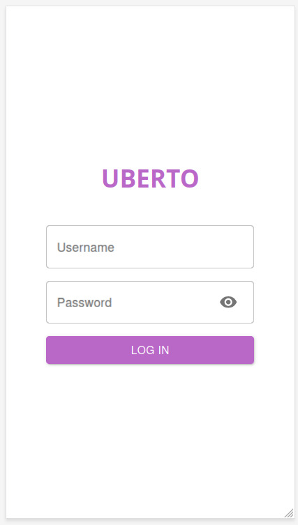 |

>[!NOTE]
>La aplicación implementa mecanismos de seguridad que aseguran que solo usuarios autenticados puedan acceder a las funcionalidades protegidas. Utiliza Spring Security junto con JWT (JSON Web Tokens) para la autenticación, y cuenta con guardas de ruta en el frontend para validar la sesión del usuario. Para ver como se implementa la seguridad de la apliación pueden visitar el repositorio del backend https://github.com/PedroMcGeraghty/uberto-backend

### Home

La pantalla principal permite al usuario completar un formulario con **origen, destino, fecha y cantidad de pasajeros**. Al presionar el botón **Filter**, la app consulta los choferes disponibles en ese horario.
Cada resultado muestra información del conductor, vehículo, patente, precio y rating. Al seleccionar un chofer, se redirige a la página de confirmación de viaje para finalizar la reserva.

| Home (form vacío) | Home (con resultados)   | Confirmación de viaje |
|-----------------------|-----------------------|-----------------------|
| 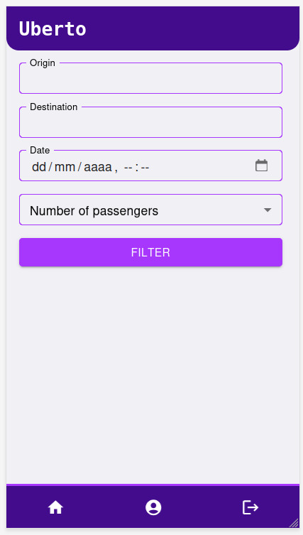 |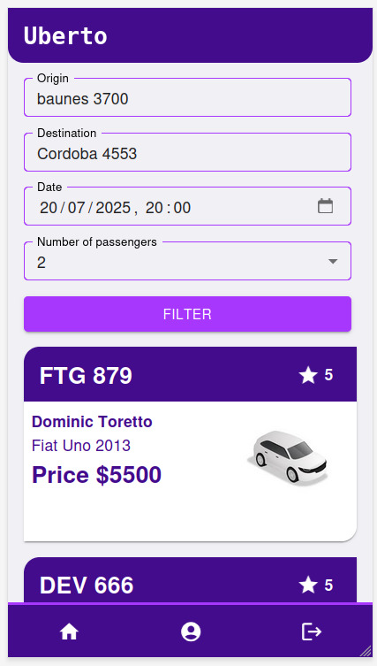 | 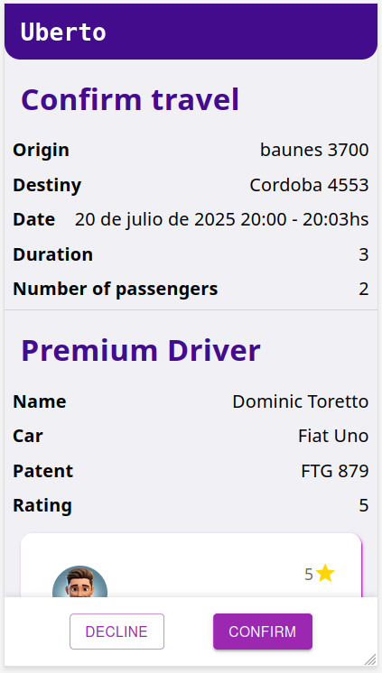  |

### Perfil del Pasajero

En esta sección, el usuario puede modificar sus **datos personales (nombre, apellido y teléfono)**, **cargar saldo** en su cuenta para utilizar en viajes, y **gestionar su red de amigos**.
Se puede **buscar usuarios, agregarlos como amigos y también eliminarlos**. Toda la información se organiza en pestañas accesibles desde el mismo perfil.

| Perfil del pasajero (Datos Personales) | Dinero disponible del Usuario | Amigos del usuario | 
|-----------------------|-----------------------|-----------------------|
| 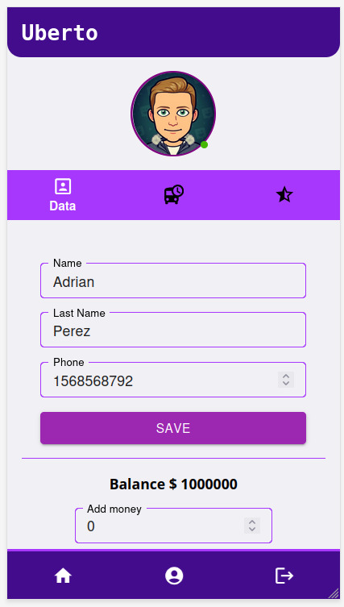 | 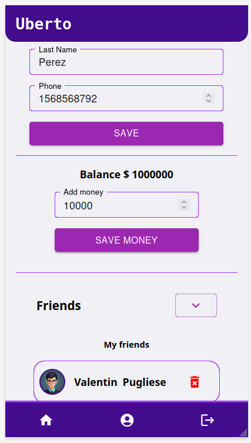 | 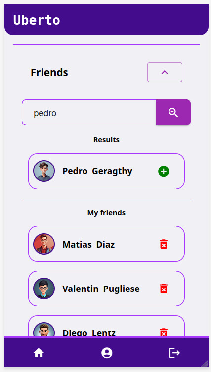

Desde el perfil, el pasajero puede acceder a:
- Viajes pendientes: lista de reservas próximas aún no realizadas.
- Viajes completados: historial de viajes ya finalizados.
- Calificación de viajes: si un viaje ya ocurrió y aún no fue calificado, el usuario puede dejar una calificación con puntaje y comentario para el chofer.

| Viajes pendientes del Pasajero | Viajes completados del pasajero | Calificacion de un viaje | 
|-----------------------|-----------------------|-----------------------|
| 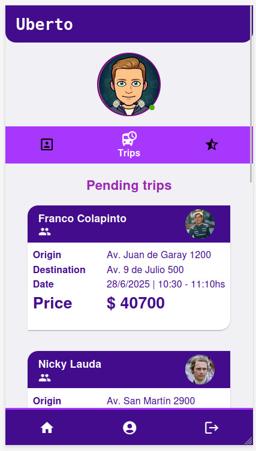 | 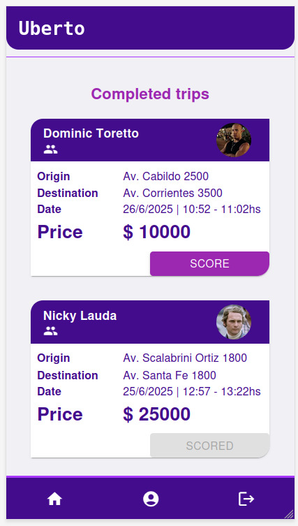 | 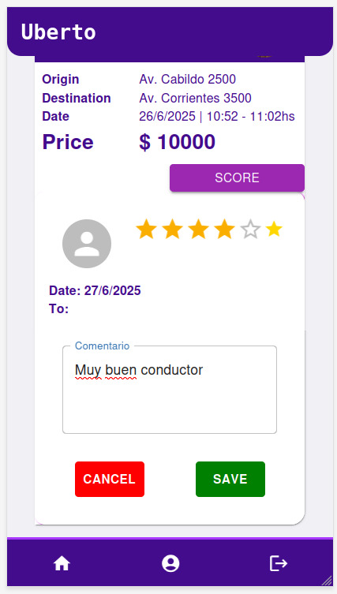

Por ultimo, el pasajero puede acceder a la lista de calificaciones que ha realizado a distintos choferes.
Cada entrada muestra el puntaje asignado y el comentario, y se brinda la posibilidad de eliminar cualquier calificación en caso de que desee modificarla o retractarse.

| Calificaciones hechas por el Pasajero |  
|-----------------------|
| 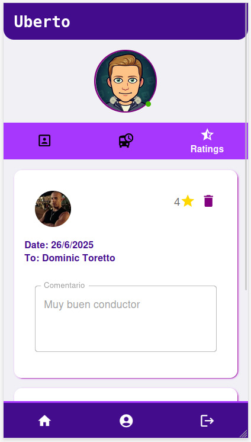 | 

### App desde el lado del Chofer

| Login | 
|-------|
| 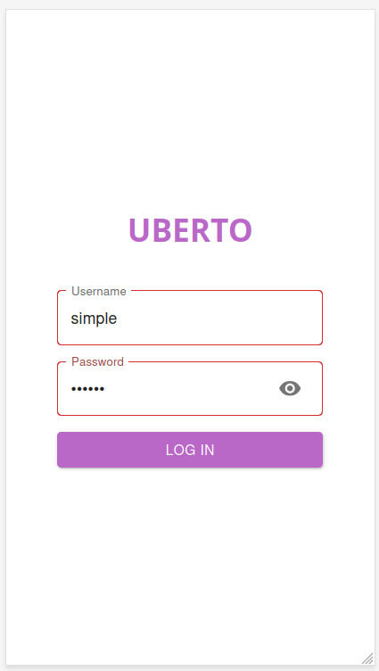 |

| Home del chofer (form vacío) | Formulario del chofer (con resultados de viajes pendientes)   
|-----------------------|-----------------------|
| 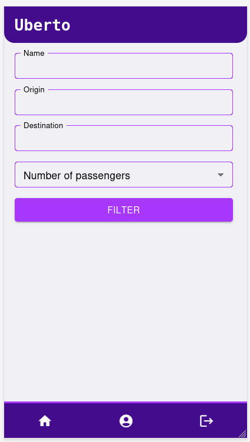 |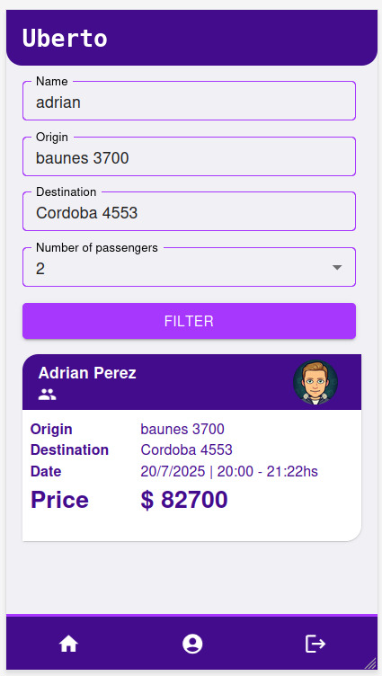 


| Perfil del chofer (Datos Personales) | Fiajes finalizados del chofer | Calificaciones hacia el chofer | 
|-----------------------|-----------------------|-----------------------|
|  | 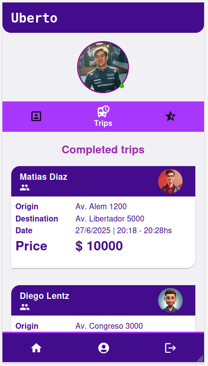 | 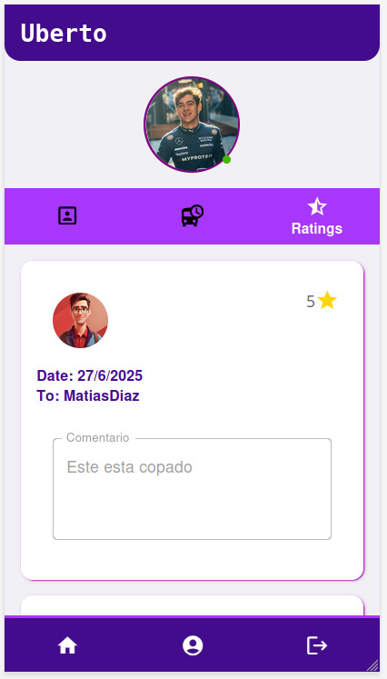


---

## ⚙️ Stack técnico
| Capa | Tecnología |
|------|------------|
| **UI** | React + Vite (TypeScript) + Material UI |
| **Estilos** | CSS |
| **Componentes visuales** | [Material UI (MUI)](https://mui.com/) |
| **Gestor de estado** | Context API / useState / useEffect |
| **Formularios** | [React Hook Form](https://react-hook-form.com/) |
| **Ruteo** | React Router |
| **HTTP client** | Axios |
| **Backend** | Kotlin + Spring Boot (API REST) |

---

## 🚀 Instalación rápida

```bash
# 1. Clonar el repo
git clone https://github.com/<tu-usuario>/uberto-frontend.git
cd uberto-frontend

# 2. Instalar dependencias
npm install        # o pnpm install / yarn

# 3. Correr la aplicación
npm start
